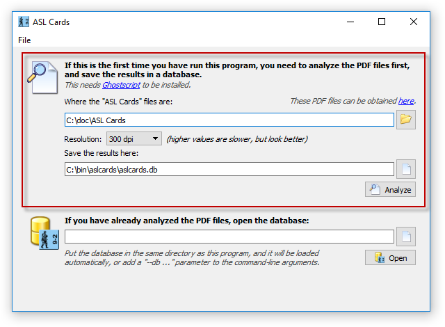
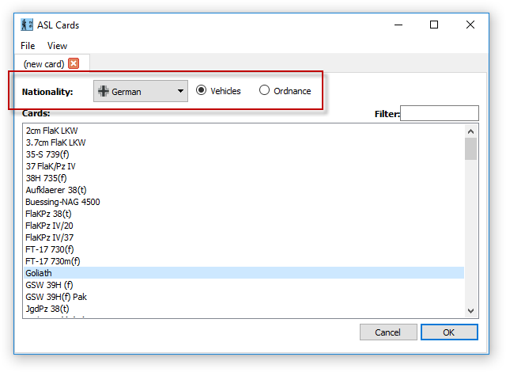
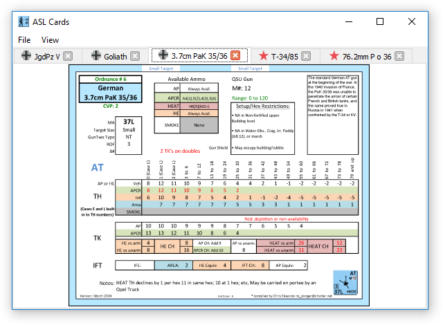

# ASL Cards

If you're a fan of [ASL](https://en.wikipedia.org/wiki/Advanced_Squad_Leader), then Chris Edward's [ASL Cards](http://aslcards.com) are a useful play tool. He provides PDF's with data cards for every AFV and Gun in the system, which are handy to reference as you play a scenario.

However, unless you print them out, it's difficult to quickly switch between the ones you want, so I wrote this program that lets you pick out the ones you want, with a tabbed viewer that lets you quickly flip between them.

### Analyzing the PDF files
The first time you run the program, it needs to analyze the PDF files, to extract each data card (this only needs to be done once).

Simply point to the directory where the files live, and click Analyze. This process can take some time to run, ~5-10 minutes at the lowest resolution, ~1 hour at the highest (so it might be a good idea to do a test run at the lowest resolution first).

You need to have [Ghostscript](https://ghostscript.com/download/gsdnld.html) installed to do this.
 

### Selecting cards
Once the files have been analyzed, you can pick out the cards you want.
 
The cards are now easily accessible as you play the scenario.
 

## FAQ

#### I'm getting errors about the number of cards and images not being the same
The program needs to know basic details about each card e.g. the name of the AFV/Gun, it's nationality. There is code to extract this text, but unfortunately, due to the way the PDF's have been constructed, it comes out garbled. To work around this, the cards have been indexed manually, and were correct at this time of writing, but if your PDF's are different to mine, you may get this error. In the <tt>index/</tt> sub-directory, there are files that list the cards contained in each PDF - edit them to match the contents of your PDF's, and things should work.

#### Windows is complaining about a missing DLL
You need the [VS 2015 Runtime](https://www.microsoft.com/en-us/download/details.aspx?id=48145) installed.
